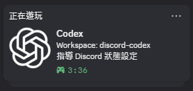

# Codex Discord Presence

## 前置需求

使用此外掛前，請先安裝 **Node.js LTS**（建議 20 以上），因為 Plugin Hook 與 Discord Presence daemon 都透過 `node` 執行。安裝完成後，在終端機確認：

```text
node --version
```

若找不到 `node` 指令，請先安裝 Node.js 並重新開啟 Codex。

<p align="center">
  
</p>

Show a local Discord Rich Presence while the Codex desktop app is running. The plugin does not read or upload prompts, project contents, or chat messages. It can optionally show the active Codex workspace and task title.

[Privacy Policy](PRIVACY.md) · [Terms of Service](TERMS.md) · [MIT License](LICENSE)

## Example



## Install

Run these commands in a terminal authenticated with GitHub:

```sh
codex plugin marketplace add mushroomTW/codex-discord-presence
codex plugin add codex-discord-presence@codex-discord-presence
```

The first command adds the marketplace and the second installs the plugin. Trust the plugin Hook when prompted, then open or resume a Codex session.

## Setup

The plugin includes the Discord Application created by mushroomTW. Users do not need to create a Discord Application or provide an Application ID.

## Controls

- Start: `node ./plugins/codex-discord-presence/scripts/start.js`
- Stop: `node ./plugins/codex-discord-presence/scripts/stop.js`
- Status: `node ./plugins/codex-discord-presence/scripts/codex-discord-presence.js --status`

The plugin uses Node.js and Discord IPC only. It supports Windows, macOS, and Linux.

The Rich Presence service starts with a Codex session and stops when that session ends. The plugin does not create an operating-system startup entry, so it can be installed, disabled, and removed through Codex without leaving a startup task behind.

Codex 會將 Presence 工作階段資料存放於單一共用本機目錄。只有近期、且不位於使用者家目錄或 Codex 資料目錄內的工作階段才會顯示 Workspace；否則保留泛用 Presence，不會暴露 Windows 使用者名稱。

## Configuration

Edit `scripts/config.json` inside the installed plugin directory, then restart the presence service.

Content updates are event-driven by default (`pollIntervalMs: 0`). Set `pollIntervalMs` to a positive millisecond value only when a filesystem watcher is unreliable and a fallback poll is needed.

`useBroker` defaults to `true`: Codex publishes its activity to the shared local Broker, which is the only process that connects to Discord IPC. The plugin bundles the Broker at `scripts/broker.js` and the daemon starts it automatically when no Broker heartbeat is present, so no manual step is required. The Broker enforces a single running instance, so Claude and Codex can both enable it safely. Set `useBroker` to `false` only for direct IPC mode.

This repository also includes a standalone copy of the Broker at `discord-presence-broker/broker.js` for running it manually with `node discord-presence-broker/broker.js`.

### Workspace and task title

```json
{
  "showWorkspace": true,
  "projectLabel": "Workspace",
  "workspaceName": "",
  "showTaskTitle": true,
  "taskTitle": "",
  "taskTitleFallback": "Vibe coding"
}
```

- Set `showWorkspace` to `true` to display the active workspace. Set it to `false` to use `details` instead.
- Change `projectLabel` to customize the prefix, for example `Workspace`.
- Set `workspaceName` to a non-empty value to override automatic workspace detection, for example `discord-codex`.
- Set `showTaskTitle` to `true` to display the active Codex task title. Set it to `false` to use the fallback text instead.
- Set `taskTitle` to a non-empty value to override automatic task-title detection.
- Change `taskTitleFallback` to customize the text shown when no task title is available.
- `showProject` remains supported as a legacy alias for `showWorkspace`.

### Repository button

```json
{
  "showRepositoryButton": true,
  "repositoryButtonLabel": "View Repository"
}
```

The button uses the current project's Git `origin` remote when it points to GitHub. Set `showRepositoryButton` to `false` to hide it. Projects without a GitHub `origin` remote do not show a button, and private repositories still require GitHub permission.

## Notes

Run Discord and Codex with the same privileges. On Linux and macOS, use the Discord desktop app and ensure the current user can access the Discord IPC socket.
